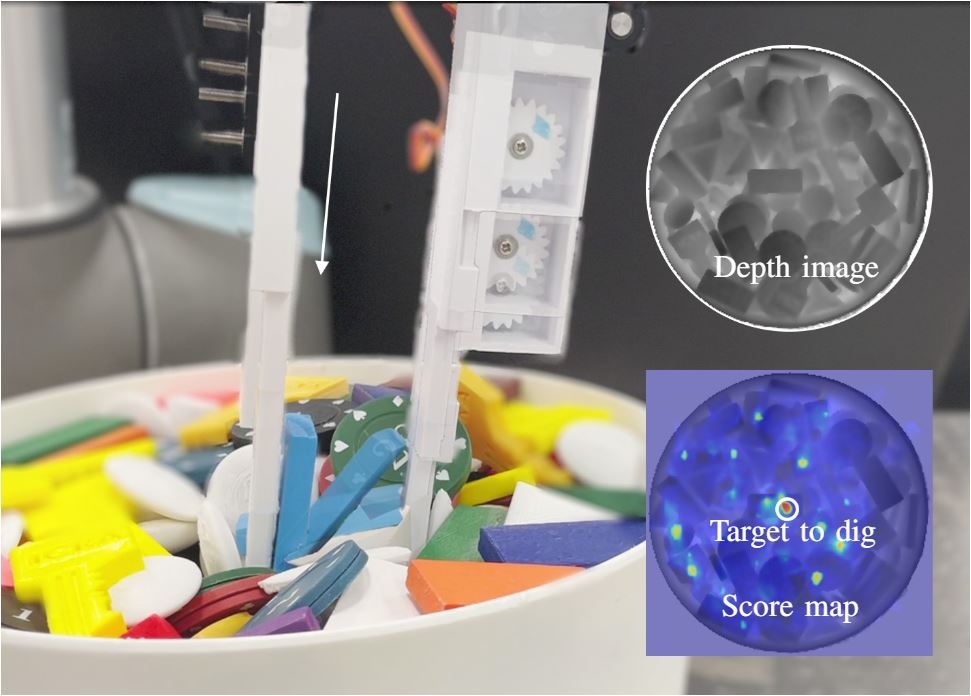

# Learning to Pick by Digging: Data-Driven Dig-Grasping

**Paper** can be seen from this [link](https://drive.google.com/file/d/1Gt1lGLKViwA0VUo-j-2dNF4c3S8ATnv_/view?usp=sharing).

If you use PyBullet in your research, please cite it like this:

```
@inproceedings{learntodig2022,
  title={Learning to Pick by Digging: Data-Driven Dig-Grasping for BinPicking from Clutter},
  author={Zhao, Chao  and Tong, Zhekai and Rojas, Juan and  Seo, Jungwon},
  booktitle={2022 IEEE International Conference on Robotics and Automation (ICRA)},
  year={2022},
  organization={IEEE}
}
```

## 1. Overview
In this work, we propose a learning-based method for bin picking, which aims at singulating and simultaneously picking the objects one by one from a random clutter. It illustrates a way of picking through a physical interaction between the robot's gripper and object clutter, which is essential to successful singulation (and subsequent picking), realized as a digging operation along a straight line. A gripper designed for this technique is capable of changing relative digit lengths such that the object being digged will not collide with the other finger. This repository provides the PyTorch implementation for training and testing this interactive picking strategy.

The following figure shows an overall process. Given a depth image, the robot learns a way of interaction (encoded in  the  score  map)  with  the  target  object  to  pick  up. The object (blue  block)  is rotated by the finger pushing it down to the clutter.
<p align = "center">
 
</p>

Video demonstration:
<p align = "center">
 
</p>
<p align = "center">
 
 
</p>

**Full Video** can be seen from this [link](https://youtu.be/3zgnn5pVX9c).


## 2. Prerequisites
### 2.1 Hardware
- [**Universal Robot UR10**](https://www.universal-robots.com/products/ur10-robot/)
- [**Robotiq 140mm Adaptive parallel-jaw gripper**](https://robotiq.com/products/2f85-140-adaptive-robot-gripper)
- [**RealSense Camera L515**](https://www.intelrealsense.com/lidar-camera-l515/)
- **Extendable Finger** for realizing the adjustable finger length. The CAD model can be found [here](https://hkustconnect-my.sharepoint.com/:f:/g/personal/ztong_connect_ust_hk/ElzIJrD7_SBMmZwoY-N5tyMB4VmvTVLndxHhNvtrc3OMmw?e=mrNvPl). 

### 2.2 Software
The code is built with Python 3.6. Dependencies are listed in [[requirements.yaml](https://github.com/HKUST-RML/Learning-to-Grasp-by-Digging_v2/blob/main/requirements.yaml "requirements.yaml")] and can be installed via [Anaconda](https://www.anaconda.com/) by running:

    conda env create -n learn_dig -f requirements.yaml
    
## 3. A Quick Start (Demo in Simulation)
This demo runs our trained model in simulation, which illustrates the bin picking of domino blocks from a cluttered bin.

**Instruction**
1. Download this repository:
```
https://github.com/HKUST-RML/Learning-to-Grasp-by-Digging_v2.git
```
2. Run the script (the trained model will be downloaded automatically):
```
    python demo.py
```

<p align = "center">
 
</p>
    
## 4. Training
The entire training process is repeated 7 times in a self-supervised manner. At each time, we recollect a dataset that contains 5000 scenes (bins of objects).

### 4.1 Dataset
We provide [here](https://hkustconnect-my.sharepoint.com/:u:/g/personal/czhaobb_connect_ust_hk/EXnUmbbMxzFOhFbPu0U12f8BZcG52E8plFfe4K3j_b_lSQ?e=mbeOMj) the dataset already collected in our last training process. 

You can train the model with this provided dataset by running:
```
python train_last_model.py
```

### 4.2 Train
If you want to create your own dataset (currently the trained objects are domino blocks, coin-shaped short cylinder, and short triangular prisms), and start training the models from scratch, please run the following code:
```
python trainer.py 
```

## 5. Testing
### 5.1 Test in Simulation
We provide a testing script to evaluate our trained model in simulation. The following code runs the test on three trained objects, and report the average grasp success rates.
```
python test_in_sim.py
```

### 5.2 Test on Real Robot (UR10)
Here we provide the steps to test our method on a real robot.

**Robot control**

Robot is controlled via [this python software](https://github.com/SintefManufacturing/python-urx).

**Camera setup**

To deploy RealSense L515 camera,
1. Download and install the [librealsense SDK 2.0](https://github.com/IntelRealSense/librealsense)
2. Our camera setting can be found in ```real/640X480_L_short_default.json```

**Start testing**

Then run the following code to start testing:
```
cd real
python test_in_real.py
```

## Maintenance 
For any technical issues, please contact: Chao Zhao (czhaobb@connect.ust.hk), Zhekai Tong (ztong@connect.ust.hk).
